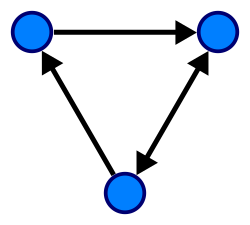
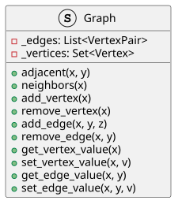
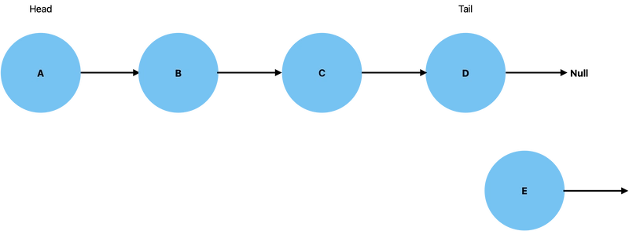
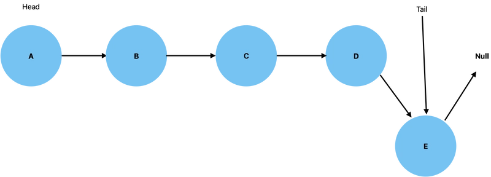
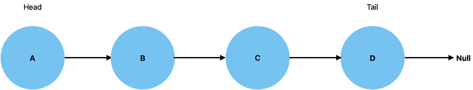
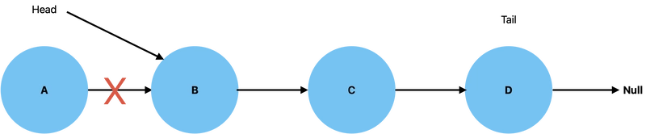

# Implementación de Estructuras de Datos y Algoritmos Optimizados en Entornos Distribuidos (Python y Nube)
## Introducción

En esta clase revisaremos las estructuras de datos fundamentales (listas, árboles, grafos, colas) y los algoritmos de búsqueda y ordenación clásicos, implementándolos en Python de forma eficiente. Además, exploraremos cómo optimizar la manipulación de datos en entornos distribuidos y aplicaciones en la nube. Se abordará la implementación desde cero (creando nuestras propias clases), para luego usar las estructuras y algoritmos proporcionados por Python, analizando su complejidad. Finalmente, veremos ejemplos prácticos de cómo aplicar algoritmos de búsqueda y ordenación en la nube (AWS, Azure, GCP), incluyendo acceso a storages en cada plataforma y uso de funciones serverless para ejecutar código en la nube. El nivel de la sesión es de Maestría, por lo que profundizaremos en eficiencia y buenas prácticas.

## Estructuras de Datos Fundamentales en Python
### Listas (Arrays Dinámicos)

Una lista en Python es una secuencia ordenada y mutable de elementos. Internamente, las listas de Python se implementan como arrays dinámicos, es decir, un bloque contiguo de memoria que puede redimensionarse según se agreguen elementos. Esto permite acceder o modificar cualquier elemento mediante índice. Las operaciones de inserción o eliminación al final de la lista son muy eficientes. Sin embargo, insertar o remover elementos al inicio o mitad de una lista es costoso, ya que se debe desplazar el resto de elementos en memoria. A nivel de implementación, cuando una lista se queda sin espacio, Python automáticamente realoca un array más grande y copia los elementos.

En Python podemos implementar desde cero una lista dinámica para entender el proceso. Por ejemplo, usando una clase que internamente use un array de la librería estándar array o la propia lista de Python como buffer. Sin embargo, normalmente usaremos la clase built-in list de Python, que ya está optimizada en C. A continuación, se muestra un simple ejemplo de implementación de un array dinámico en Python para ilustrar la idea de redimensionamiento:

```Python
class DynamicArray:  
    def __init__(self):
        self.capacity = 1  # capacidad inicial
        self.length = 0    # elementos actuales
        self.data = [None] * self.capacity

    def append(self, value):
        # si está lleno, realocar con el doble de capacidad
        if self.length == self.capacity:
            self._resize(2 * self.capacity)
        self.data[self.length] = value
        self.length += 1

    def _resize(self, new_cap):
        new_data = [None] * new_cap
        for i in range(self.length):
            new_data[i] = self.data[i]
        self.data = new_data
        self.capacity = new_cap

# Uso de DynamicArray
arr = DynamicArray()
for i in range(5):
    arr.append(i)
print(arr.data, arr.length, arr.capacity)  # [0, 1, 2, 3, 4, None, None, None] 5 8

```

En este ejemplo, nuestro DynamicArray duplica su capacidad cuando se llena. Python hace algo similar de manera eficiente en C por eso list.append tiende a ser muy rápido en promedio. Una vez entendida la implementación, en aplicaciones reales se utiliza directamente list de Python, aprovechando sus operaciones optimizadas. En resumen, las listas nos proporcionan versatilidad para almacenar colecciones y permiten: acceso indexado rápido, añadir/remover al final eficientemente, pero no son ideales para inserciones/eliminaciones frecuentes al comienzo (donde conviene usar otras estructuras, como veremos con las colas).

### Árboles (Ejemplo: Árbol Binario de Búsqueda)

Un árbol es una estructura de datos jerárquica compuesta por nodos con una relación padre-hijo. En particular, un árbol binario de búsqueda (BST) es un tipo de árbol binario donde cada nodo tiene a lo sumo dos hijos (izquierdo y derecho), y se cumple que los valores del subárbol izquierdo son menores al valor del nodo, y los del subárbol derecho son mayores. Esta propiedad ordenada permite búsquedas eficientes: en un BST balanceado, buscar un elemento tiene complejidad promedio O(log n) lo que implica que el tiempo necesario para completar la operación (la búsqueda, en este caso) crece de forma muy lenta a medida que se añaden más elementos ($n$), ya que se descarta la mitad del árbol en cada comparación. Sin embargo, en el peor caso (por ejemplo, si el árbol se “degenera” significa que pierde su estructura de árbol eficiente y se transforma en una estructura ineficiente que es funcionalmente equivalente a una lista enlazada) la búsqueda puede ser O(n). Además de búsqueda, los BST soportan inserción y eliminación en tiempo.


En la Figura vemos un ejemplo de un árbol binario de búsqueda de 9 nodos y profundidad 3, con 8 en la raíz. Cada nodo a la izquierda tiene un valor menor, y a la derecha un valor mayor que la raíz, manteniendo orden para búsqueda eficiente. En un BST balanceado, operaciones de búsqueda, inserción y eliminación son O(log n) en promedio, aunque en el peor caso degenerado podrían caer a O(n). 

Para implementar desde cero un árbol binario en Python, definimos una clase `Node` con atributos para el valor y punteros a sus hijos, y funciones para insertar o buscar elementos recursivamente. 

Por ejemplo:

```Python
class Node:
    def __init__(self, value):
        self.value = value
        self.left = None
        self.right = None

class BinarySearchTree:
    def __init__(self):
        self.root = None

    def insert(self, value):
        if not self.root:
            self.root = Node(value)
        else:
            self._insert_rec(self.root, value)

    def _insert_rec(self, current, value):
        if value < current.value:
            if current.left:
                self._insert_rec(current.left, value)
            else:
                current.left = Node(value)
        else:
            if current.right:
                self._insert_rec(current.right, value)
            else:
                current.right = Node(value)

    def search(self, value):
        return self._search_rec(self.root, value)

    def _search_rec(self, current, value):
        if current is None:
            return False
        if value == current.value:
            return True
        elif value < current.value:
            return self._search_rec(current.left, value)
        else:
            return self._search_rec(current.right, value)

```
Este código define una estructura fundamental en informática: un Árbol Binario de Búsqueda (BST). Aquí te explico la función de cada clase y método, y cómo usarlo para construir y manipular un árbol.

El código se divide en dos clases que trabajan juntas:

#### 1. Clase Node: La Unidad Básica  
Esta clase define la estructura de cada elemento individual dentro del árbol.

| Atributo | Propósito | Valor Inicial |
| :--- | :--- | :--- |
| **`self.value`** | Almacena el **dato real** del nodo (un número o texto). | El valor pasado en la creación. |
| **`self.left`** | Referencia al subárbol **izquierdo** (valores menores). | `None` (inicialmente sin hijo). |
| **`self.right`** | Referencia al subárbol **derecho** (valores mayores). | `None` (inicialmente sin hijo). |

#### 2. Clase BinarySearchTree: El Contenedor  
Esta clase gestiona la colección de nodos y las reglas del BST.

| Atributo | Propósito |
| :--- | :--- |
| **`self.root`** | La raíz del árbol. Es el punto de partida para todas las operaciones. |


#### Uso y Funcionamiento de los Métodos 
1. Inserción (insert y _insert_rec)  
El objetivo es añadir un nuevo valor (value) al árbol, manteniendo la propiedad de BST: valores menores van a la izquierda, y valores mayores van a la derecha.

| Método | Función | Mecanismo |
| :--- | :--- | :--- |
| **`insert(self, value)`** | **Método Público:** Punto de entrada para el usuario. | Si el árbol está vacío (`self.root` es `None`), el nuevo nodo se convierte en la raíz. Si no, llama al método recursivo (`_insert_rec`). |
| **`_insert_rec(self, current, value)`** | **Método Privado (Recursivo):** Recorre el árbol. | 1. **Compara** el `value` con el valor del nodo actual (`current.value`). 2. Si el `value` es menor, va a la **izquierda**. Si ya hay un nodo izquierdo, se llama a sí mismo (recursión) con el nodo izquierdo como nuevo `current`. Si no hay un nodo izquierdo, **inserta el nuevo nodo allí**. 3. Si el `value` es mayor o igual, sigue el mismo proceso a la **derecha**. |

2. Búsqueda (search y _search_rec)  
El objetivo es verificar si un valor específico existe en el árbol.

| Método | Función | Mecanismo |
| :--- | :--- | :--- |
| **`search(self, value)`** | **Método Público:** Punto de entrada para el usuario. | Llama al método recursivo (`_search_rec`), comenzando siempre desde la **raíz** (`self.root`). |
| **`_search_rec(self, current, value)`** | **Método Privado (Recursivo):** Recorre el árbol eficientemente. | 1. **Caso base 1:** Si `current` es `None`, el valor no está en el árbol, devuelve **`False`**. 2. **Caso base 2:** Si el `value` coincide con `current.value`, lo encontró, devuelve **`True`**. 3. **Recursión:** Si `value` es menor, busca recursivamente en el subárbol **izquierdo**. Si es mayor, busca recursivamente en el subárbol **derecho**. |

#### Ejemplo de Construcción y Uso
Aquí te muestro cómo usar las clases para construir un BST con los valores [50, 30, 70, 20, 40, 60, 80]:

**Paso 1: Inicializar el Árbol**

```Python
bst = BinarySearchTree()
print(f"Raíz inicial: {bst.root}") # Resultado: None
```

**Paso 2: Insertar Valores**

```Python
valores = [50, 30, 70, 20, 40, 60, 80]
for v in valores:
    bst.insert(v)
```

**Estructura del Árbol (internamente):**

* 50 (Raíz)
    * Izquierda: 30
        * Izquierda: 20
        * Derecha: 40
    * Derecha: 70
        * Izquierda: 60
        * Derecha: 80

**Paso 3: Buscar Valores**

```Python
# Búsqueda exitosa
encontrado = bst.search(40)
print(f"¿40 está en el árbol? {encontrado}") # Resultado: True

# Búsqueda fallida
no_encontrado = bst.search(99)
print(f"¿99 está en el árbol? {no_encontrado}") # Resultado: False
```
El método search demuestra la eficiencia logarítmica ($O(\log n)$) que mencionamos antes, ya que descarta la mitad del árbol en cada comparación.

En este código, insert y search operan de forma recursiva siguiendo la propiedad del BST: van a la izquierda o derecha según el valor buscado. La búsqueda devuelve True si encuentra el valor (o False al llegar a una hoja nula). Tras implementar un BST manualmente, es importante notar que Python no trae una estructura de árbol binario built-in. Si se requiere un BST balanceado, se suelen usar bibliotecas (por ejemplo, bintrees o usar bisect sobre listas ordenadas, etc.), o estructuras nativas como heaps (heapq) si el objetivo es siempre extraer el mínimo/máximo. No obstante, conceptualmente los árboles son útiles y en entornos distribuidos aparecen en formas especializadas (como árboles B en bases de datos, árboles de Merkle en blockchain, etc.).

### Grafos



Un grafo es una estructura que modela relaciones entre entidades mediante nodos (vértices) y aristas (edges) que conectan pares de nodos. Formalmente, un grafo se define como un conjunto de vértices V y un conjunto de aristas E (pares de vértices). Pueden ser dirigidos (aristas con dirección) o no dirigidos. En la práctica, para representar un grafo en código suelen utilizarse dos técnicas principales: lista de adyacencia o matriz de adyacencia. 



En la lista de adyacencia, para cada vértice se mantiene una lista de los vecinos a los que está conectado (es muy eficiente en espacio para grafos dispersos). En la matriz de adyacencia, se utiliza una matriz |V|x|V| donde en la posición (i,j) se indica la existencia (y posiblemente peso) de la arista de i a j. Esta última facilita ciertas operaciones de consulta en O(1) (por ejemplo, verificar si existe conexión directa entre i y j), pero consume más memoria y es O(V^2) para recorrer todas las conexiones.

Para implementar un grafo simple en Python, podemos usar un diccionario que mapea cada nodo a una lista (o conjunto) de nodos adyacentes. 

Por ejemplo:

```Python
class Graph:
    def __init__(self):
        self.adjacency = {}  # dict de lista de adyacencia

    def add_vertex(self, v):
        if v not in self.adjacency:
            self.adjacency[v] = []

    def add_edge(self, u, v):
        # Grafo no dirigido (añadir en ambas listas)
        self.add_vertex(u)
        self.add_vertex(v)
        self.adjacency[u].append(v)
        self.adjacency[v].append(u)

    def neighbors(self, v):
        return self.adjacency.get(v, [])

```

La clase está diseñada para representar un grafo donde los nodos (vértices) y las conexiones (aristas) se almacenan en un diccionario de Python.

#### 1. __init__(self): Inicialización
```Python
def __init__(self):
    self.adjacency = {}  # dict de lista de adyacencia
```
* Propósito: Es el constructor de la clase. Se llama cuando creas una nueva instancia del grafo.
* Mecanismo: Inicializa self.adjacency como un diccionario vacío. Este diccionario es el núcleo del grafo:
    * Clave del diccionario: Un vértice (nodo) del grafo.
    * Valor del diccionario: Una lista que contiene todos los vecinos (vértices adyacentes) de esa clave.

#### 2. add_vertex(self, v): Agregar Vértice
```Python
def add_vertex(self, v):
    if v not in self.adjacency:
        self.adjacency[v] = []
```
* Propósito: Asegura que un nodo (v) exista en el grafo.
* Mecanismo: Si el vértice v aún no es una clave en el diccionario self.adjacency, lo añade y le asigna una lista vacía como su lista de vecinos. Si ya existe, no hace nada (lo que evita duplicados).

#### 3. add_edge(self, u, v): Agregar Arista (Conexión)
```Python
def add_edge(self, u, v):
    # Grafo no dirigido (añadir en ambas listas)
    self.add_vertex(u)
    self.add_vertex(v)
    self.adjacency[u].append(v)
    self.adjacency[v].append(u)
```
* Propósito: Crea una conexión entre dos vértices, u y v.
* Mecanismo:
    * Llama a self.add_vertex(u) y self.add_vertex(v) para asegurar que ambos nodos existen en el diccionario.
    * Añade v a la lista de vecinos de u.
    * Añade u a la lista de vecinos de v.
    * **Nota clave:** Este doble paso es lo que hace que el grafo sea no dirigido (la conexión es bidireccional: si puedes ir de A a B, también puedes ir de B a A).

#### 4. neighbors(self, v): Obtener Vecinos
```Python
def neighbors(self, v):
    return self.adjacency.get(v, [])
```
* Propósito: Devuelve la lista de vértices conectados directamente al vértice v.
* Mecanismo: Utiliza self.adjacency.get(v, []). El método .get() es seguro: si v existe, devuelve su lista de vecinos; si v no existe en el grafo, devuelve una lista vacía ([]), evitando un error de clave.

#### Ejemplo de Uso Práctico
Imagina que quieres crear un grafo de ciudades y carreteras que las conectan.

1. Inicializar el Grafo  
Crea una instancia de la clase:

```Python
ciudades = Graph()
print(ciudades.adjacency) # Resultado: {}
```

2. Agregar Vértices (Ciudades)  
Los nombres de las ciudades serán nuestros vértices:
```Python
ciudades.add_vertex("Bogota")
ciudades.add_vertex("Medellin")
ciudades.add_vertex("Cali")
ciudades.add_vertex("Barranquilla")
# 'Bogota': [], 'Medellin': [], 'Cali': [], 'Barranquilla': []
```

3. Agregar Aristas (Carreteras)  
Añade conexiones entre ellas:
```Python
ciudades.add_edge("Bogota", "Medellin")
ciudades.add_edge("Bogota", "Cali")
ciudades.add_edge("Medellin", "Barranquilla")
```

4. Inspeccionar el Resultado  
Ahora, mira cómo quedó el diccionario de adyacencia.
```Python
print(ciudades.adjacency)
```

Resultado esperado:
```bash
{
    'Bogota': ['Medellin', 'Cali'],
    'Medellin': ['Bogota', 'Barranquilla'],
    'Cali': ['Bogota'],
    'Barranquilla': ['Medellin']
}
```
5. Usar el Método neighbors  
Consulta quiénes son los vecinos de una ciudad:
```Python
vecinos_bogota = ciudades.neighbors("Bogota")
print(f"Vecinos de Bogota: {vecinos_bogota}") # Resultado: ['Medellin', 'Cali']

vecinos_nodos_inexistentes = ciudades.neighbors("Pereira")
print(f"Vecinos de Pereira: {vecinos_nodos_inexistentes}") # Resultado: []
```

En este ejemplo, cada clave en self.adjacency es un vértice, y el valor es la lista de sus vecinos. Con métodos similares podríamos implementar grafos dirigidos (añadiendo solo v en la lista de u para una arista dirigida u->v). Una vez construido el grafo, algoritmos fundamentales para recorrerlo son BFS (Breadth-First Search) y DFS (Depth-First Search), que veremos en la siguiente sección.

Desde el punto de vista de eficiencia, las operaciones típicas en grafos (como recorrer o buscar rutas) tienen complejidad proporcional al número de vértices V y aristas E. Por ejemplo, recorrer un grafo completo con BFS o DFS es O(V + E), ya que visita cada vértice y cada arista a lo sumo una vez. Esto es lineal en el tamaño de la representación del grafo, lo cual es óptimo. Otras operaciones, como verificar adyacencia, son O(1) en matriz de adyacencia o O(deg(v)) en lista de adyacencia (donde deg(v) es el grado del vértice v). En general, elegir la representación adecuada depende de la densidad del grafo y las operaciones requeridas.


### Colas (Queues)

Una cola es una estructura de datos lineal que sigue la política FIFO (First-In First-Out), es decir, el primer elemento en entrar es el primero en salir. Podemos imaginar una cola como una fila de personas: el primero en la fila es atendido antes que los que llegaron después. 


El la figura anteriore, podemos ver la ilustración de una cola (FIFO). El elemento A está en el frente de la cola listo para salir primero, seguido por B, C y D en ese orden

Las operaciones básicas son Enqueue (encolar, insertar un elemento al final de la cola) y Dequeue (desencolar, retirar el elemento frontal). También suele definirse front o peek para consultar el valor al frente sin desencolar.

El método Enqueue se utiliza para añadir nuevos nodos a la cola. Recuerde que lo que define una cola es su estructura FIFO, por lo que todos los nodos nuevos deben añadirse al final de la cola. A continuación, se muestra una ilustración para visualizar una operación de encolado.



Antes de declarar el nuevo nodo como la Cola de la cola, la Cola anterior apunta su próximo valor al nuevo Nodo.



El método Dequeue se utiliza para eliminar el primer nodo de nuestra lista vinculada.



Esto se hace estableciendo el segundo nodo de la cola en la Cabeza, antes de quitar la Cabeza anterior de la cola.




En las colas, las inserciones ocurren en la parte trasera y las eliminaciones en la delantera. Esta disciplina garantiza que el primero en entrar es el primero en salir, análogo a una fila en la vida real.

Las colas pueden implementarse eficientemente mediante listas enlazadas o usando la colección deque (double-ended queue) de Python. Aunque podríamos usar list para simular una cola (usando append para encolar y pop(0) para desencolar), esto último es ineficiente porque pop(0) es O(n) (los demás elementos se desplazan). En cambio, collections.deque está optimizado para operaciones en ambos extremos en O(1). 

A continuación un ejemplo simple utilizando deque:

```Python
from collections import deque

queue = deque()
# Enqueue
queue.append("A")
queue.append("B")
queue.append("C")
print(queue)   # deque(['A', 'B', 'C'])
# Dequeue
front = queue.popleft()
print(front)   # 'A'
print(queue)   # deque(['B', 'C'])
```