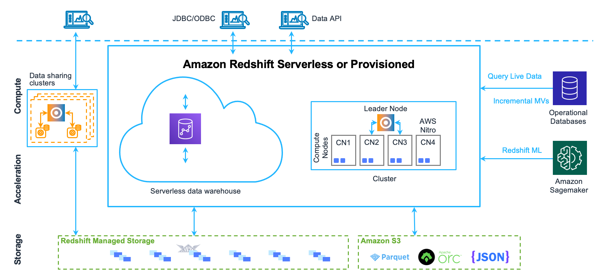

# Curso Ingeniería de Datos en Plataformas en la Nube y Data Warehousing con Python - Sesion 8

## 2. Introducción a Data Warehousing con Amazon Redshift (AWS)

Pasamos ahora a la capa de Data Warehouse en AWS: Amazon Redshift. Redshift es un servicio totalmente administrado de almacenamiento de datos (data warehouse) que permite ejecutar consultas SQL analíticas sobre grandes volúmenes de datos de manera eficiente. Está basado en una versión modificada de PostgreSQL y diseñado para escalar de cientos de gigabytes a petabytes de datos, aprovechando almacenamiento columnar y procesamiento masivamente paralelo (MPP)[\[9\]](#ref9)[\[10\]](#ref10).

### 2.1 Creación y arquitectura básica de Redshift
Un clúster de Redshift consiste en uno o más nodos de cómputo más un nodo líder (si hay más de un nodo de cómputo)[\[11\]](#ref11). 



El nodo líder gestiona la coordinación: recibe las consultas, las optimiza y distribuye trabajo a los nodos de cómputo[\[12\]](#ref12)[\[13\]](#ref13). Los nodos de cómputo almacenan porciones de los datos y ejecutan las consultas en paralelo, retornando resultados parciales al nodo líder que los combina para la respuesta final. Esta arquitectura de cluster con procesamiento paralelo permite que Redshift maneje consultas complejas sobre enormes conjuntos de datos de forma mucho más rápida que una base de datos tradicional de un solo nodo[\[14\]](#ref14)[\[9\]](#ref9).


Cada nodo de cómputo en Redshift se subdivide en slices (rebanadas), que son unidades paralelas internas; los datos se distribuyen entre slices para aprovechar todos los cores disponibles[\[15\]](#ref15). Redshift almacena los datos en formato columnar (cada columna por separado), y aplica compresión por columna, lo que reduce I/O y acelera scans de columnas específicas. Además, Redshift compila las consultas a código nativo (C++), evitando interpretaciones repetitivas y mejorando la velocidad de ejecución.

Para crear un clúster Redshift, usualmente se sigue uno de dos caminos: - Cluster provisionado tradicional: Definimos número de nodos, tipo de nodo (por ejemplo, DC2 para almacenamiento SSD local, RA3 para almacenamiento desacoplado en S3), etc. Por ejemplo, para fines de prueba o free trial, se puede iniciar con un solo nodo DC2.Large, que tiene ~160 GB de almacenamiento SSD comprimido. - Redshift Serverless: (Nueva modalidad) En lugar de manejar nodos directamente, AWS ofrece Redshift Serverless donde simplemente se usa el warehouse sin aprovisionar infraestructura fija; el cobro es por segundo de uso. En un nivel de maestría vale la pena mencionarlo, aunque en ejercicios prácticos quizá se use el modo clásico por familiaridad. Redshift Serverless tiene la ventaja de auto-escalar capacidad y simplificar la administración.

**_Creación mediante consola:_** AWS Management Console tiene un asistente donde eliges el nombre del cluster, credenciales de admin (usuario awsuser típico), número de nodos, tipo, etc. Para nuestro propósito educativo, seleccionar 1 nodo DC2.Large con configuración por defecto es suficiente. Una vez creado (puede tardar ~5 minutos en estar disponible), se obtiene un endpoint (host) del estilo `redshift-cluster-1.xxxxxx.us-west-2.redshift.amazonaws.com:5439` que sirve para conectar vía SQL.

**_Creación mediante Python:_** Alternativamente, se puede usar Boto3 o AWS CLI. Un ejemplo con boto3 (simplificado):
```python
import boto3
redshift = boto3.client('redshift', region_name='us-west-2')

response = redshift.create_cluster(
    ClusterIdentifier='mi-cluster',
    NodeType='dc2.large',
    MasterUsername='awsuser',
    MasterUserPassword='MiPassw0rd',
    NumberOfNodes=1
    # (otros parámetros opcionales como VPC/Subnet, etc.)
)
```
Tras ejecución, habría que esperar a que el cluster pase a estado Available. Nota: Crear un cluster vía API requiere permisos y a menudo configurar networking (por defecto crea en una VPC default). Para simplificar, la consola web es más directa para nuevos usuarios.

**_Redshift Free Trial:_** Es importante mencionar que Redshift no está en el Free Tier permanente de AWS, pero Amazon ofrece una prueba gratuita de 2 meses que incluye 750 horas de un nodo DC2.Large por mes. En otras palabras, se puede tener un cluster 24/7 durante dos meses sin costo. Esto permite a estudiantes o profesionales evaluar Redshift con sus propias cargas. Pasado ese período, o si se escalan nodos, empiezan los cargos. Una estrategia en entornos de aprendizaje es apagar `(pause)` el cluster cuando no se use `(Redshift cobra por hora de instancia encendida)`. Alternativamente, Redshift Serverless ofrece un cuota gratuita de espectro bajo `(por ejemplo, cierto monto de "Redshift Processing Units" gratis por mes)`, que también puede ser aprovechada en laboratorios.

### 2.2 Carga de datos y consultas básicas en Redshift
Una vez que tenemos el cluster, el flujo común es: `cargar datos -> ejecutar consultas SQL analíticas`. Redshift soporta SQL estándar (con algunas diferencias menores de Postgres). Veamos cómo llevar datos de ejemplo al warehouse y hacer consultas.

**_Carga de datos (COPY):_** La forma más eficiente de cargar datos en Redshift es mediante el comando COPY, que puede leer directamente desde archivos en S3 (u otros orígenes como Amazon DynamoDB o incluso desde el cliente). En un escenario típico, un data engineer almacenará datos crudos en S3 (en CSV, JSON, Parquet, etc.) y luego usará COPY para ingestar a tablas Redshift. COPY es masivo y paralelo: los nodos de Redshift leen simultáneamente partes de los archivos de S3. 

**_Ejemplo de uso de COPY en Python usando el conector Redshift:_**
```python
import redshift_connector

# Conectar al cluster Redshift
conn = redshift_connector.connect(
    host='redshift-cluster-1.xxxxxx.us-west-2.redshift.amazonaws.com',
    database='dev',
    user='awsuser',
    password='MiPassw0rd'
)
cursor = conn.cursor()

# Crear una tabla de ejemplo
cursor.execute("""
CREATE TABLE ventas (
    id INT,
    fecha DATE,
    monto DECIMAL(10,2),
    categoria VARCHAR(50)
)
""")

# Copiar datos desde un CSV en S3 a la tabla (asumiendo el CSV no tiene cabecera y campos separados por coma)
cursor.execute("""
COPY ventas
FROM 's3://mi-bucket-datos/ventas2025.csv'
IAM_ROLE 'arn:aws:iam::123456789012:role/RedshiftCopyRole'
FORMAT AS CSV
DELIMITER ','
IGNOREHEADER 1;
""")
conn.commit()
```
En el ejemplo, usamos la librería `redshift_connector` (el cliente nativo de Redshift para Python) para conectarnos al cluster con las credenciales correspondientes. Creamos una tabla ventas con columnas id, fecha, monto, etc. Luego ejecutamos `COPY ventas FROM 's3://...csv' IAM_ROLE '...' CSV;`. Este comando carga el archivo CSV almacenado en S3 directamente a la tabla (necesitamos proveer un rol de IAM que autorice a Redshift a leer del bucket S3, o alternativamente podemos usar claves AWS en el comando). Una vez completado, los datos están en Redshift listos para consultarse.

**_Consultas SQL básicas:_** Ahora podemos ejecutar consultas SQL con el cursor. Por ejemplo, contar filas o hacer agregaciones:
```python
cursor.execute("SELECT categoria, SUM(monto) as total FROM ventas GROUP BY 1;")
result = cursor.fetchall()
for row in result:
    print(row)
```

Esto devolvería el total vendido por categoría. Las consultas en Redshift se escriben como en PostgreSQL estándar. Podemos realizar joins entre tablas, agregaciones con GROUP BY, subconsultas, funciones de ventana, etc., sobre millones o miles de millones de filas, y Redshift las procesará distribuidamente.

La ventaja clave es que Redshift ha sido optimizado para consultas analíticas complejas sobre datasets muy grandes (mediciones, logs, datos de sensores, transacciones, etc.), que tardarían horas en bases de datos convencionales, pero en Redshift se resuelven en segundos o minutos gracias al paralelismo y optimizaciones internas. Por ejemplo, Redshift puede escanear miles de millones de registros usando decenas de núcleos trabajando en paralelo, con pushdown de predicados a nivel de almacenamiento columnar para leer solo los datos relevantes.

**_Ejemplo práctico (escenario Retail, continuación):_** retomemos los datos de ventas almacenados en S3. Con el comando COPY los cargamos a una tabla ventas en Redshift. Ahora podemos consultar: `"¿Cuál fue la venta total por tienda el último mes?"` mediante SQL. Si la tabla tiene cientos de millones de filas (imaginemos ventas de muchos años), Redshift ejecutará la agregación en paralelo. Un analista podría conectarse con una herramienta BI como Tableau o superset a Redshift y obtener estos resultados rápidamente para visualización. La familiaridad con SQL es un plus: los usuarios no necesitan aprender un nuevo lenguaje, Redshift soporta la mayoría de las funciones SQL habituales.

### 2.3 Optimización de rendimiento en Redshift
Operar Redshift a gran escala requiere comprender ciertas opciones de diseño que influyen en el rendimiento. Dos de las más importantes son las estrategias de distribución de datos y las claves de ordenamiento (sort keys). Además, el mantenimiento regular `(VACUUM, ANALYZE)` y el diseño eficiente de consultas ayudan a sacar el máximo provecho del cluster.

* **_Distribución de datos (DISTKEY):_** Cuando creamos una tabla en Redshift, podemos especificar su Distribution Style/Key. Esto determina cómo se reparten las filas de la tabla entre los nodos y slices. Las opciones principales son:
    * `EVEN (por defecto si no se especifica):` distribuye filas equitativamente en todos los nodos (hash aleatorio). Es útil si no se sabe un patrón específico, pero puede causar mucho tráfico de red en joins.  
    * `KEY <columna>:` distribuye según el hash de una columna clave. Filas con el mismo valor de esa columna van al mismo nodo. Esto reduce movimiento de datos en consultas que hacen join en esa columna, ya que datos con la misma clave están co-localizados. Por ejemplo, si tenemos tablas de ventas y de tiendas, podríamos usar store_id como DISTKEY en ambas, así todas las ventas de una tienda y la info de la tienda caen en el mismo nodo y el join no requiere intercambiar datos entre nodos.  
    * `ALL:` replica la tabla completa en todos los nodos. Útil solo para tablas pequeñas de referencia (dimensiones pequeñas) porque duplica datos. Evita costo de join porque cada nodo tiene una copia completa.  
    
    Elegir bien la distribución es crucial para evitar data skew (desequilibrio) y redistribuciones costosas en runtime. Por ejemplo, si una tabla está distribuida por cliente_id pero el 10% de filas tienen el mismo cliente (un cliente muy activo), entonces ese nodo tendrá más carga (data skew). En tal caso, quizá era mejor otra estrategia.

* **_Claves de ordenamiento `(SORTKEY)`:_** Redshift almacena los datos en cada nodo ordenados físicamente según columnas que definamos como sort key. Esto es similar a un índice clustering. Una sort key adecuada permite que Redshift lea solo un rango de blocks de disco para responder a consultas con filtros en esa columna, en lugar de hacer full scan. **Buenas prácticas:**  
    * Si consultas frecuentemente por rango de fechas, define la columna fecha como primer `SORTKEY`. Redshift almacenará las filas ordenadas cronológicamente, y las consultas `WHERE` fecha `BETWEEN` ... leerán solo el segmento relevante `(pruning)`. Esto acelera mucho las consultas de time-series y también mejora la compresión (valores cercanos tienden a ser similares).  
    * Si tienes joins frecuentes y ya definiste un `DISTKEY`, a veces también usas esa misma columna como parte del `SORTKEY` para beneficiar mergesort joins.  
    * En sort keys compuestas, ordena las columnas de baja cardinalidad a alta para que la primera divida los datos en bloques grandes y la siguiente refine dentro de esos bloques.  

    **_Ejemplo:_** Una tabla de logs puede tener `SORTKEY` (fecha, region) si las consultas suelen acotarse por fecha y analistas filtran a veces por region dentro de un rango temporal.  

* **_Compresión y columnas seleccionadas:_** Redshift generalmente aplica automáticamente compresión óptima (cuando se usa COPY con COMPUPDATE ON o se analiza la tabla). Aun así, es importante seleccionar solo las columnas necesarias en las consultas `(evitar SELECT *)`. Esto minimiza I/O de lectura. Por ser columnar, si solo consultas 5 de 50 columnas, Redshift leerá solo esas 5 del disco, reduciendo el volumen escaneado.  
* **_Vacuum & Analyze:_** Redshift no reusa inmediatamente el espacio de filas borradas o actualizadas `(usa borrados lógicos)`, por lo que con el tiempo las tablas pueden fragmentarse. Es recomendable correr VACUUM periódicamente para reclamo de espacio y reordenación según sort key, y `ANALYZE` para actualizar estadísticas de distribución de datos que el optimizador de consultas usa. Un buen mantenimiento evita degradación de rendimiento a medida que se modifica la data.  
* **_Workload Management (WLM):_** En entornos multi-usuario, Redshift permite configurar colas de ejecución con ciertas concurrencias y prioridades. Un mal `WLM (ej. demasiadas consultas pesadas en paralelo sin control)` puede saturar I/O y RAM. En nivel introductorio, se suele usar la configuración default, pero a nivel avanzado se puede evaluar separar cargas ETL pesadas en una cola y las consultas de dashboard en otra, por ejemplo.  
* **_Monitoreo y tuning:_** Revisar planes de consulta con `EXPLAIN`, monitorear tablas de sistema `(como STL_EXPLAIN, SVL_QUERY_REPORT, etc.)` nos ayuda a identificar cuellos de botella (por ejemplo, si muchos joins usan broadcast o repartition, indica que quizás faltó alinear distkeys; si vemos disk spill indica que la consulta excedió RAM y hubo que usar disco, tal vez aumentar QUERY_GROUP memory o optimizar la consulta).  

Para resumir, unas mejores prácticas de rendimiento:  
* Diseñar esquema con distribución y sort keys apropiadas para minimizar shuffles y lecturas innecesarias.  
* Escribir consultas eficientes: seleccionar solo columnas necesarias, filtrar por sortkeys, evitar subconsultas anidadas complejas si se puede, etc.  
* Usar materialized views o tablas agregadas para casos de reportes muy frecuentes que involucren cálculo pesado repetitivo. - Mantener el cluster (vacuum, analyze, ajustar WLM si es el caso).  
* Escoger el tipo de nodo adecuado: si el dataset es enorme pero consultas relativamente simples, nodos RA3 con Redshift Managed Storage (almacenamiento escalable en S3) pueden ser rentables; si es más pequeño pero de alta concurrencia, quizá más nodos DC2 (SSD) o incluso Redshift Serverless con auto-scaling.

**_Ejemplo práctico (escenario Salud):_** supongamos que estamos analizando datos de pacientes y tratamientos de varios hospitales. Tenemos una tabla de pacientes (~100 millones de registros) y otra de tratamientos (~1 billón de registros). Para optimizar:  
* Usamos `DISTKEY = patient_id` en la tabla de tratamientos y en pacientes, de forma que todos los tratamientos de un paciente residen en el mismo nodo que la fila del paciente. Así los joins por `patient_id` no requieren movimiento inter-nod.  
* Usamos `SORTKEY = treatment_date` en la tabla de tratamientos porque la mayoría de análisis son por rangos de fechas (e.g. tratamientos en el último año).  
* Creamos las tablas inicialmente con `COMPUPDATE ON` para que Redshift analice y aplique compresión óptima (por ejemplo, columnas de códigos de diagnóstico quizás queden con codificación de diccionario).  
* Cada noche corremos `VACUUM REINDEX` y `ANALYZE` en ventanas de bajo uso para mantener la salud del cluster.  
* Limitamos la concurrencia a, digamos, 10 consultas pesadas a la vez para que no compitan en exceso `(WLM)`.  

Siguiendo estas prácticas, las consultas (por ejemplo, "conteo de tratamientos por tipo en el último trimestre por hospital") corren en segundos en lugar de minutos, y la plataforma soporta escalar a más datos con mínima fricción.

### 2.4 Redshift Spectrum y data lakes
Como especialista en big data en AWS, es relevante mencionar Redshift Spectrum, una característica que extiende la capacidad de Redshift para consultar datos directamente en S3 sin cargarlos al cluster. Es decir, Spectrum permite crear tablas externas en Redshift que referencian datos en un bucket S3 (usando AWS Glue Data Catalog para definir metadatos de esos archivos). Las consultas pueden combinar datos locales de Redshift y datos externos en S3. Por ejemplo, podríamos dejar datos históricos `"en frío"` en S3 en formato Parquet y exponerlos en Redshift como tabla externa; una consulta uniría datos recientes `(en Redshift)` con históricos `(en S3 vía Spectrum)`. Esto proporciona flexibilidad de data lake junto con el data warehouse. BigQuery, como veremos enseguida, tiene un concepto similar con external tables sobre GCS – en ambos casos la idea es evitar movimientos de grandes datos cuando no es necesario.  

Bajo el capó, Redshift Spectrum paraleliza el scan de S3 usando recursos elastically `(paga por TB escaneado)`. 

**_Caso de uso:_** En el escenario de retail, quizás mantenemos las ventas de los últimos 2 años en Redshift `(para reporting frecuente)` pero las ventas de hace >2 años las descargamos en S3 como archivo Parquet particionado por año/mes. Con Spectrum, si algún análisis necesita esos datos antiguos, se puede hacer un `SELECT ... FROM ventas_externa WHERE año=2019` y Redshift Spectrum leerá solo la partición 2019 desde S3. Dado que los datos están en columna Parquet, Spectrum solo escaneará columnas necesarias, minimizando costo. Esto es costo-eficiente para datos `"fríos"` que igual necesitamos mantener: almacenarlos en S3 es más barato que en nodos Redshift, y consultarlos con Spectrum sale económico si es esporádico.  

Con esta visión, completamos la sección de Redshift. A continuación, cambiamos a Google Cloud para ver su solución de data warehousing: BigQuery, que adopta un enfoque distinto (serverless y completamente administrado por Google). 

# Referencias
<a id="ref9">[9]</a> [AWS Redshift Architecture: 5 Important Components](https://airbyte.com/data-engineering-resources/aws-redshift-architecture#:~:text=Redshift%20combines%20columnar%20storage%20with,processing%20time%20for%20large%20datasets)  
<a id="ref10">[10]</a> [A Complete Guide to DataWarehousing on AWS with Redshift](https://www.datacamp.com/tutorial/guide-to-data-warehousing-on-aws-with-redshift#:~:text=)  
<a id="ref11">[11]</a> [Data warehouse system architecture](https://docs.aws.amazon.com/redshift/latest/dg/c_high_level_system_architecture.html#:~:text=The%20core%20infrastructure%20component%20of,data%20warehouse%20is%20a%20cluster)  
<a id="ref12">[12]</a> [Leader node](https://docs.aws.amazon.com/redshift/latest/dg/c_high_level_system_architecture.html#:~:text=Leader%20node)  
<a id="ref13">[13]</a> [Clusters](https://docs.aws.amazon.com/redshift/latest/dg/c_high_level_system_architecture.html#:~:text=A%20cluster%20is%20composed%20of,are%20transparent%20to%20external%20applications)  
<a id="ref14">[14]</a> [The Complete Guide to Amazon Redshift Architecture and its Components](https://medium.com/@arskrivov/the-complete-guide-to-amazon-redshift-architecture-and-its-components-e56f7d33e533)  
<a id="ref15">[15]</a> [Node slices](https://docs.aws.amazon.com/redshift/latest/dg/c_high_level_system_architecture.html#:~:text=Node%20slices)  